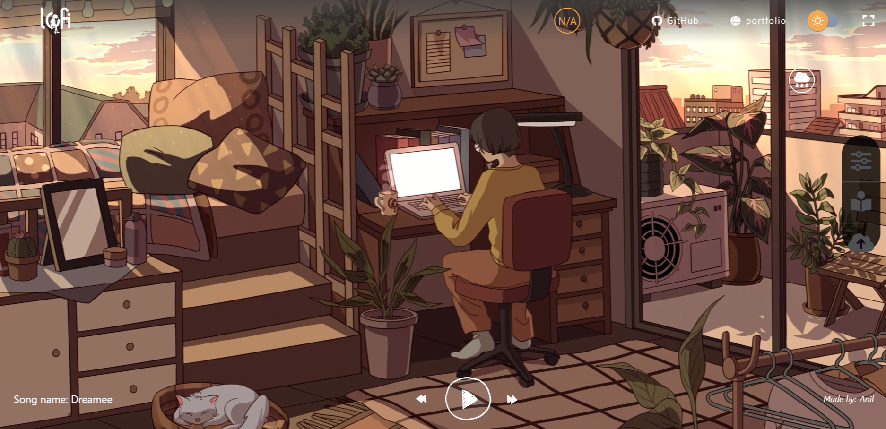
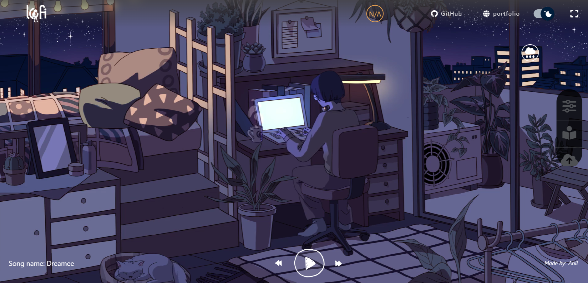

# Lofi Music Website


A beautiful lofi music website built with React.js and TypeScript that provides a soothing and relaxing experience for music lovers. Create your perfect ambient environment for studying, working, or just relaxing.

> If you like this project, please give it a star ⭐ and feel free to contribute!

## Demo

### Preview Images





### Demo Videos

Watch the demo videos to see the website in action:

<video width="100%" controls>
  <source src="public/assets/imageDemo/demo3.mp4" type="video/mp4">
  Your browser does not support the video tag.
</video>

<video width="100%" controls>
  <source src="public/assets/imageDemo/DemoVid1.mp4" type="video/mp4">
  Your browser does not support the video tag.
</video>

## Features

- 🎵 **Music Player** - Full-featured player with play, pause, skip, and volume controls
- 📤 **Custom Song Upload** - Upload and add your own songs to the playlist
- 🌙 **Dark/Light Mode** - Toggle between themes for day and night listening
- 🔊 **Ambient Sounds** - Mix in ambient sounds:
  - Rain (city, forest)
  - Fire (campfire, fireplace)
  - Nature (birds, ocean, wind)
  - Urban (traffic, city sounds)
- ⏱️ **Focus Timer** - Built-in countdown timer for study sessions
- 📝 **Todo List** - Keep track of tasks while you relax
- 🎨 **Multiple Moods** - Choose from various visual themes:
  - Day/Night
  - Sunny/Rainy
  - And more...

## Tech Stack

- **Frontend**: React.js 17.0.2 with TypeScript
- **State Management**: Redux Toolkit
- **Styling**: SCSS / Sass
- **Build Tool**: Create React App
- **Deployment**: Vercel

## Getting Started

### Prerequisites

- Node.js (v14 or higher)
- npm or yarn

### Installation

1. Clone the repository

```bash
git clone https://github.com/Agent07-X-lab/lofi-music-website.git
```

2. Navigate to the project directory

```bash
cd lofi-music-website
```

3. Install dependencies

```bash
# Using npm
npm install

# Using yarn
yarn install
```

4. Start the development server

```bash
# Using npm
npm start

# Using yarn
yarn start
```

5. Open your browser and visit `http://localhost:3000`

## Project Structure

```
lofi-music-website/
├── public/
│   ├── assets/
│   │   ├── icons/          # SVG icons
│   │   ├── imageDemo/      # Demo images and videos
│   │   ├── lofi/           # Background music tracks
│   │   ├── musics/         # Ambient sound effects
│   │   └── video/          # Background videos
│   └── index.html
├── src/
│   ├── components/         # React components
│   │   ├── CountDownTimer/
│   │   ├── DarkLightSwitch/
│   │   ├── Home/
│   │   ├── ModifierBoard/
│   │   ├── Player/
│   │   ├── RainToggleButton/
│   │   ├── SongUploader/
│   │   ├── TimerStyled/
│   │   └── TodoList/
│   ├── constants/          # App constants
│   ├── data/               # Static data
│   ├── layout/             # Layout components (Header, Footer)
│   ├── pages/              # Page components
│   ├── store/              # Redux store and slices
│   ├── types/              # TypeScript interfaces
│   ├── App.tsx
│   └── index.tsx
├── package.json
├── tsconfig.json
└── README.md
```

## Contributing

Contributions are welcome! Please feel free to submit a Pull Request.

## License

This project is licensed under the MIT License - see the LICENSE file for details.

## Acknowledgments

- Inspired by lofi hip hop radio from YouTube
- Thanks to all contributors and music creators

---

Made with ❤️ for lofi lovers
